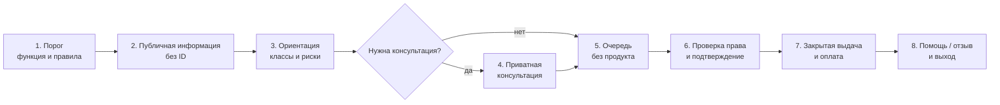

# Retail Environment

## Роль пространства

Точка — не место открытия продукта и не destination. Это спокойный интерфейс ориентации, консультации, проверки права и безопасной выдачи.

Она должна:

1. помочь принять или пересмотреть уже возникшее решение;
2. снизить риск ошибки и импульсного увеличения покупки;
3. обеспечить достойную процедуру и возможность уйти без покупки.

## Не один магазин, а семейство точек

Общая грамматика может применяться в лицензированной рознице, аптечной выдаче, специализированном центре и контролируемом помещении. Общими остаются информация, нейминг, упаковка, знак, запрет продвижения и аудит. Доступ, квалификация сотрудника, наблюдение и планировка меняются по риску.

MVP моделирует только **нейтральную лицензированную точку без употребления на месте**.

## Фасад

- обычный городской фасад без медиаэкрана и светового шоу;
- одно стандартизированное обозначение функции;
- часы, правила доступа, доступность и помощь читаются снаружи;
- товар и упаковка не видны с улицы;
- нет фирменных цветов производителя, плакатов и временных кампаний;
- нет эффекта тайного клуба: вход различим, безопасен и не маскируется;
- прозрачность используется для ориентации и безопасности, но не открывает продуктовую выкладку;
- вывеска не обещает опыт и не использует слово «премиальный», «экспертный» или «новый».

Рабочая надпись MVP:

> **Регулируемая точка доступа**  
> информация · консультация · выдача · помощь

## Зоны

### 1. Порог

Человек понимает назначение точки, условия, доступные языки и право получить информацию без покупки. ID по умолчанию не проверяется на входе.

### 2. Публичная информация

Карта классов, объяснение знака системы, общий принцип риска, помощь и обратная связь. Здесь нет наличия, цены и товарной стены.

### 3. Ориентация

Статичные карточки и каталог. Первым показывается способ классификации и риска, затем список типов. Нет browsing по эмоциям.

### 4. Приватная консультация

Небольшая акустически защищённая зона в поле безопасной видимости. Она не выглядит как VIP-комната и доступна без покупки.

### 5. Очередь

Короткая, ясная и без товарных стимулов. Нет кассовых мелочей, экранов, рейтингов, новинок и звуковых сигналов продаж.

### 6. Проверка и подтверждение

Право проверяется только в момент необходимости. Экран развёрнут так, чтобы данные не видел следующий человек. Сотрудник повторяет родовое имя, единицу и количество.

### 7. Выдача

Товар поступает из закрытого хранения после подтверждения. Нет витрины, демонстрационного ритуала, branded bag или дополнительного предложения.

### 8. Выход

Чек и нейтральная карточка содержат продуктовую запись, отзыв и помощь. Нет купона, просьбы оценить покупку или приглашения вернуться.

## Выкладка и хранение

- хранение закрытое или behind-the-counter по режиму;
- порядок по родовому классу, форме и активному содержанию;
- одинаковая видимость наличия и цены;
- нет facing, золотой полки, торцевых зон и «последней единицы»;
- возврат и отзыв отделены от новой выдачи;
- отходы и повреждённые единицы не попадают в публичную зону;
- инвентарный интерфейс персонала не ранжирует по марже или скорости продажи.

## Материалы

`HYPOTHESIS` Прототип использует стандартные и ремонтопригодные материалы:

- матовая краска тёплого нейтрального тона;
- коммерческий линолеум или другой тихий нескользкий пол;
- окрашенный металл и ламинированные рабочие поверхности;
- перфорированные акустические панели без декоративного паттерна;
- обычное прозрачное или матовое стекло там, где нужна безопасность и приватность;
- одинаковая мебель для сопоставимых функций.

Не используются полированный камень, тёмное зеркало, цветное стекло, необработанное «крафтовое» дерево как wellness-код, бархат, хромированный glam и намеренно тюремные материалы.

## Мебель

- стойка — рабочая, не барная и не пьедестал;
- сидения — только для ожидания, консультации и доступности;
- нет lounge, communal table, фотозоны и пространства события;
- высоты и проходы доступны;
- сумки и личные вещи можно разместить без контакта с продуктом;
- служебная безопасность не демонстрируется как наказание.

## Навигация

Она отвечает только на вопросы:

- где информация;
- где консультация;
- где проверка и выдача;
- где помощь;
- почему возможен отказ;
- где жалоба и выход.

Навигация не обещает эффекты и не делит пространство на «энергия», «релакс», «социализация» или «творчество».

## Пакет и чек

Пакет — неброский стандартный носитель с необходимой маркировкой приватности и безопасности, без знака как украшения. Чек содержит родовое имя, единицу, количество, партию или ссылку на неё, возврат/отзыв и помощь. Он не содержит рекламы.

## Пространственные антипаттерны

- Apple Store для веществ;
- аптека как декор без клинической функции;
- тёмный запретный клуб;
- музей ужасов;
- полицейский checkpoint на входе;
- бар или дегустационный зал;
- wellness-лаборатория;
- универмаг с информационными плакатами поверх обычной выкладки.

## Критерий пространства

> Человек может понять, спросить, получить или отказаться — без соблазняющего маршрута, публичного стыда и лишнего пребывания.

