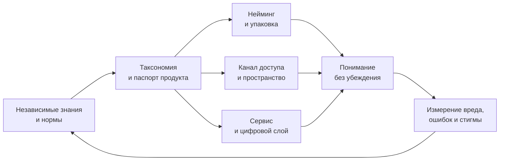

# Responsible Control — MVP бренд-системы

## Что это

Responsible Control — рабочее название общественно-ориентированной системы идентификации, информации и регулируемого доступа к алкоголю, никотину, лекарствам и другим психоактивным веществам.

Это не бренд продукта и не концепт «магазина наркотиков». Это единый потребительский протокол, который переводит public-health-принципы в упаковку, пространство, сервис, цифровые интерфейсы, свет, звук и поведение операторов.

> [!important] Главный инвариант
> Система должна одновременно **не стимулировать употребление**, **не скрывать значимую информацию** и **не стигматизировать человека**.

## Что значит «антибренд»

В этом проекте антибренд — не отсутствие дизайна и не намеренно неприятная среда. Это дисциплина, при которой дизайн:

- создаёт доверие к процедуре, но не переносит доверие на вещество;
- помогает распознать продукт, силу, риск, условия доступа и помощь;
- не создаёт желание, престиж, принадлежность, коллекционность или импульс;
- делает легальный канал функционально предпочтительным за счёт ясности и надёжности, а не удовольствия от покупки;
- остаётся спокойным, доступным и достойным.

## Статус версии

`v0.1-skeleton` — концептуальный MVP для обсуждения и прототипирования. Он не задаёт реальных дозировок, медицинских порогов, юридических режимов или окончательных технических спецификаций. Все такие поля остаются переменными до выбора юрисдикции и внешней валидации.

## Маркеры доказательности

| Маркер | Значение |
|---|---|
| `SOURCE` | положение непосредственно поддержано рабочим корпусом источников |
| `SYNTHESIS` | вывод из сопоставления нескольких источников |
| `HYPOTHESIS` | наше проектное решение, которое требуется проверить |
| `OPEN` | решение нельзя честно принять на текущих данных |

## Карта проекта

1. [[00_Project_Brief]] — задача, границы и критерии MVP.
2. [[01_Evidence_Map]] — четыре основных отчёта и реализованные прецеденты.
3. [[02_Principles_and_Red_Lines]] — конституция системы.
4. [[03_Audiences_and_Situations]] — не «ЦА продаж», а пользователи, правообладатели и контексты.
5. [[04_Brand_Core]] — миссия, видение, ценности и супер-идея.
6. [[05_Brand_Platform]] — essence, позиционирование, SMP, характер и тон.
7. [[06_Anti_Brand_Test]] — проверка любого решения на скрытое продвижение и стигму.
8. [[07_Information_Architecture]] — слои информации и доказательность.
9. [[08_Visual_System]] — типографика, цвет, сетка, изображения, знак и движение.
10. [[09_Product_and_Naming]] — родовой нейминг и продуктовая таксономия.
11. [[10_Packaging_System]] — три семейства упаковки и лицевая иерархия.
12. [[11_Retail_Environment]] — фасад, зоны, навигация, материалы и путь.
13. [[12_Staff_Behaviour]] — роль сотрудника, сценарии разговора и запреты.
14. [[13_Sensory_Standard]] — музыка, звук, свет, запах, экраны и темп.
15. [[14_Channels_and_Digital]] — сайт, каталог, уведомления, данные и публичная речь.
16. [[15_MVP_Prototype]] — что именно собрать для первой проверки.
17. [[16_Metrics_and_Testing]] — критерии понимания, непривлекательности и достоинства.
18. [[17_Governance_and_Versioning]] — кто может менять систему и по каким основаниям.
19. [[18_Open_Decisions]] — неизвестные, которые нельзя маскировать дизайном.
20. [[19_Roadmap_90_Days]] — путь от скелета к тестируемому прототипу.
21. [[20_One_Page]] — вся система на одной странице.
22. [[21_Presentation_System]] — Figma-сетка, layouts и точная карта презентации MVP.

## Архитектура в одном контуре

## Быстрый маршрут

Для первого просмотра: [[20_One_Page]] → [[02_Principles_and_Red_Lines]] → [[08_Visual_System]] → [[10_Packaging_System]] → [[11_Retail_Environment]] → [[12_Staff_Behaviour]] → [[13_Sensory_Standard]] → [[15_MVP_Prototype]].
