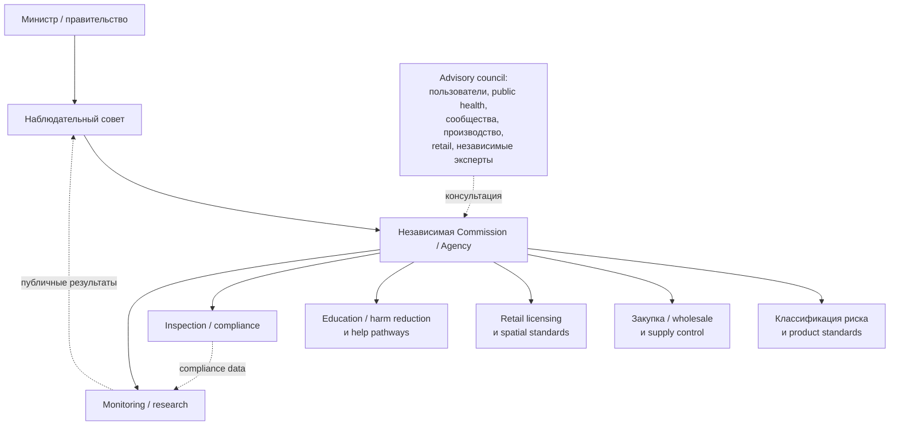
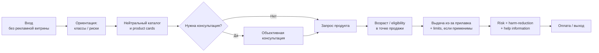
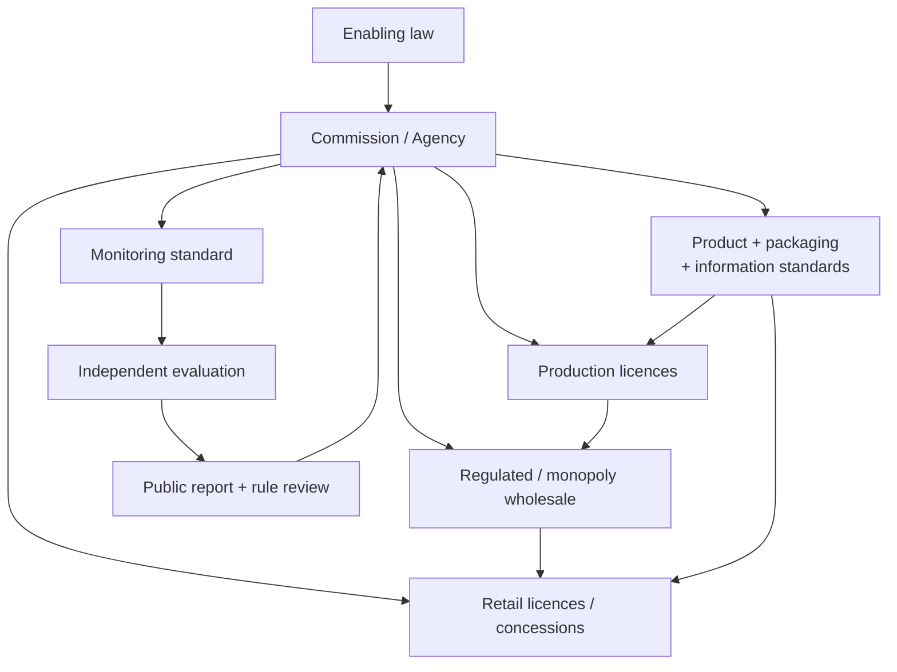

# Public Health Perspectives for Regulating Psychoactive Substances: теоретическая архитектура решения

**Автор аналитического файла:** OpenAI, GPT-5.5 Thinking  
**Дата:** 3 сентября 2026  
**Основной источник:** Health Officers Council of British Columbia, *Public Health Perspectives for Regulating Psychoactive Substances: What We Can Do About Alcohol, Tobacco, and Other Drugs*, November 2011  
**Статус:** аналитическая реконструкция для проектного брифа; не юридическое заключение  
**Полный Markdown-файл:** текущий документ  
**Оригинал HOC BC:** [PDF — Public Health Perspectives for Regulating Psychoactive Substances](https://healthofficerscouncil.net/wp-content/uploads/2012/12/regulated-models-v8-final.pdf)

В исходном документе HOC BC выступает институциональным автором; отдельно отмечен вклад Mark Haden в концепции, организацию, написание и подбор источников. Документ датирован ноябрём 2011 года. citeturn25view0

**Как читать этот анализ:** формулировка **«HOC»** ниже означает, что положение содержится в докладе; **«проектное следствие»** означает мою реконструкцию того, как это положение может быть переведено в бренд-, продуктовый, пространственный или цифровой стандарт; **«не указано»** означает, что параметр отсутствует в HOC и его нельзя честно приписывать авторам.

## Executive summary и контекст

Доклад HOC BC предлагает не нерегулируемую легализацию, а перенос всей цепочки психоактивных веществ — производства, опта, дистрибуции, розницы, доступности, информации и продвижения — под согласованный контроль, ориентированный прежде всего на общественное здоровье. Регуляторная интенсивность должна быть пропорциональна потенциальному соотношению общественного вреда и пользы, менее вредные варианты должны быть доступнее более вредных, а коммерческое стимулирование потребления — исключено. Из этого авторы выводят возможность государственной монополии, лицензируемого рынка с обязательствами по общественному здоровью или некоммерческой дистрибуции, а также отказ от рекламного брендинга, унифицированную небредированную упаковку, контроль концентраций и состава, специализированную розницу, подготовленный персонал и обязательную информацию о рисках и помощи. При этом HOC прямо предупреждает: это не готовый нормативный кодекс, а набор предложений для обсуждения; правила должны разрабатываться отдельно для конкретных веществ, а при недостатке доказательств — проверяться постепенно и экспериментально. citeturn17view0turn25view1

Исторический контекст доклада важен. Авторы пытались уйти от бинарной схемы «коммерческий легальный рынок против уголовного запрета». В отношении алкоголя и табака они видели проблему в коммерческой мотивации увеличивать продажи; в отношении нелегальных веществ — в побочных последствиях запрета и передаче рынка организованной преступности. Поэтому искомая область регулирования располагается между крайностями полного запрета и свободной коммерциализации. citeturn25view1turn25view2

В executive summary HOC использует тогдашние канадские оценки Rehm et al. для 2002 года: алкоголь, табак и нелегальные вещества, по приведённым там расчётам, были связаны с 21% смертей, 24,9% потенциально потерянных лет жизни и 19,4% дней пребывания в acute-care hospitals; годовые общественные издержки оценивались примерно в C$39,8 млрд. Это **историческая аргументация доклада 2011 года, а не актуальная оценка на 2026 год**, поэтому для современного брифа эти цифры не следует использовать без обновления данных. citeturn25view0

Самый существенный методологический caveat находится на страницах 27–28: HOC говорит, что описывает, как **в общем виде** могла бы выглядеть новая система; не все инструменты применимы ко всем веществам, а перед внедрением необходим более детальный policy analysis. Следовательно, HOC лучше использовать как **policy constitution**, а не как готовое техническое задание. citeturn25view1

## Принципы регулирования и логика системы

Центральный принцип HOC — изменить саму функцию рынка. Governance/business model должен служить общественному интересу, здоровью и безопасности, а accountability должна быть направлена к обществу через государство, а не к акционерам. HOC рассматривает государственную монополию, лицензирование производителей и retailers с обязательствами в области общественного здоровья и community-based non-profit production/distribution как разные допустимые организационные инструменты одной цели. citeturn25view1turn17view1

**Запрет маркетинга.** HOC трактует promotion значительно шире обычной рекламы: в перечень входят рекламные сообщения, брендирование и коммерческий нейминг, sponsorship, gifting, ассоциации с известными людьми и фильмами, связь употребления со спортом, социальной успешностью, сексуальностью или отдыхом, ценовые промоакции и утверждения об удовольствии или улучшении performance. Логика здесь принципиальная: регулировать необходимо не только медиаразмещение, но и саму систему производства желания. citeturn17view2

**Унифицированная небредированная упаковка.** Отказ от брендинга продолжается на уровне физического продукта. HOC считает, что упаковка должна выполнять функции consumer protection: сообщать состав и концентрацию активных компонентов, предупреждения и потенциальный вред, соответствовать стандартам качества и безопасности и не содержать ложных утверждений. В цепочке поставок авторы также предполагают возможность стандартизировать размер потребительской единицы, максимальные концентрации, содержание активных веществ и contaminants, а упаковку выполнять только на лицензированных площадках. Точные шрифты, цвета, иконки, naming syntax или concentration thresholds доклад **не указывает**. citeturn17view0turn17view2turn25view2

**Регуляция пропорционально риску.** HOC не предлагает готовую универсальную таблицу наркотиков по классам. Вместо этого он устанавливает метапринцип: интенсивность регулирования должна зависеть от потенциального population-level соотношения вреда и пользы, а среди доступных вариантов менее вредные формы должны получать более благоприятный режим. Следовательно, для дизайн-проекта **классификатор ещё предстоит создать** — его нельзя просто извлечь из доклада. citeturn17view0

Рабочая проектная интерпретация такого классификатора может выглядеть так:

| Ось классификации | Что оценивается | Возможное влияние на систему |
|---|---|---|
| Острый риск | вероятность тяжёлого острого вреда | режим доступа, объём единицы, предупреждения, необходимость консультации |
| Потенциал зависимости | вероятность формирования компульсивного употребления | лимиты, частота доступа, prominence информации о помощи |
| Долгосрочный вред | хронические последствия | warning hierarchy, финансовые и availability controls |
| Вред третьим лицам | impairment, воздействие дыма/аэрозоля, транспортные и социальные риски | правила места употребления, предупреждения, санкции |
| Форма и путь употребления | различие риска между формами одного вещества | отдельный класс упаковки и доступности |
| Концентрация | содержание активных компонентов | concentration tiers и режим выдачи |
| Контаминанты и вариабельность | чистота и стабильность продукта | лабораторный стандарт, batch traceability, recall |
| Неопределённость доказательств | уверенность в существующей evidence base | более осторожный режим, pilot, усиленная evaluation |

Это **проектное расширение**, а не классификация HOC. Числовые веса, клинические пороги, дозировочные пределы и медицинские warnings в исходнике не заданы и должны разрабатываться независимыми специалистами по toxicology, medicine, pharmacy и epidemiology. HOC, напротив, подчёркивает необходимость evidence, постепенного внедрения и корректировки политики при неожиданных последствиях. citeturn17view0turn25view1

**Контроль доступности.** HOC рассматривает цену и налогообложение как инструменты общественного здоровья; одновременно легальная цена должна оставаться достаточно конкурентоспособной относительно нелегального рынка. Возможны ограничения количества одной покупки, плотности и географии точек, часов работы, запрет vending machines и более строгий, вплоть до prescription, режим для некоторых веществ или концентрированных форм. citeturn17view1turn17view2

Возраст 19 лет и проверка ID у людей, которые выглядят моложе 25 лет, — конкретные предложения канадского документа 2011 года, а не универсальные параметры системы. В проектном брифе их корректнее хранить как переменные `AGE_MIN` и `ID_CHECK_THRESHOLD`, которые задаёт соответствующая юрисдикция. citeturn17view1turn17view2

**Розница как информационный, а не рекламный интерфейс.** HOC предполагает небольшие неприметные специализированные точки с некоммерческим либо близким к медицинскому/аптечному характером оформления; вывеска должна лишь обозначать функцию точки. Авторы предлагают отсутствие self-service, выдачу из-за прилавка, отсутствие unrelated merchandise, подготовку персонала, ограничения плотности/локации/часов и возможность внезапных инспекций. Альтернативой для части веществ может быть behind-the-counter dispensing в аптеке. citeturn17view1

**Персонал.** HOC предлагает обучать сотрудников не технике продаж, а информации о свойствах веществ, возможном вреде и альтернативных вариантах, распознаванию проблемных паттернов употребления и маршрутам помощи; отдельно упоминаются навыки управления ситуациями с посетителями в состоянии интоксикации и basic first aid. Информация о prevention, harm reduction и treatment должна быть заметно доступна в самой точке. citeturn17view1turn17view2

**Этика.** Среди фундаментальных принципов HOC — informed consent, consumer protection, individual autonomy, compassion, ограничение уголовных санкций прежде всего поведением, вредящим другим, не-стигматизация и недискриминация пользователей и providers, а также лёгкий доступ к помощи. Это важно для проекта: анти-маркетинговая среда не должна превращаться в punitive design. citeturn17view0

## Архитектура: agency, продукт, retail, digital и помощь

**Организационная архитектура.** Appendix 9 разворачивает пример государственной monopoly-type модели вокруг arm’s-length provincial Commission. Её задача — supply control, demand reduction и implementation законодательства; primary mandate должен быть связан с предотвращением заболеваний и травм, health promotion/protection и harm minimization, а финансовая модель — с cost recovery, а не максимизацией прибыли. Commission может быть единственным уполномоченным wholesale purchaser/import source и единственным источником товара для retail; сам retail может либо управляться ей непосредственно, либо передаваться лицензированным операторам. citeturn17view3

HOC отдельно пытается защитить такую структуру от regulatory capture: предполагаются declarations of financial interests и недопуск к governance лиц с конфликтом интересов. Консультативный контур должен включать не только государство и медицинских специалистов, но и людей, употребляющих вещества, производителей, distributors, retailers, local government, экспертов по mental health/addictions, social services, youth, education, Indigenous issues, environment, criminal justice, inspection и enforcement. citeturn17view3

Для реального проекта я бы добавил к HOC одно governance-разделение: market operator, regulator/compliance и independent evaluator должны либо быть институционально разделены, либо иметь жёсткие внутренние barriers. Это **проектное следствие** из требований HOC к accountability и public evaluation; конкретную организационную схему авторы не задают. citeturn25view2turn25view3

**Продуктовая архитектура.** Если убрать consumer branding, название продукта должно превратиться из эмоционального имени в спецификацию. Рабочая схема для брифа:

`[вещество / класс] — [форма] — [класс концентрации] — [стандартная единица] — [batch]`

Это не предложенный HOC синтаксис — его в докладе нет. Однако он непосредственно следует из двух его положений: branding/naming относится к promotion, а упаковка должна передавать объективные характеристики и предупреждения. citeturn17view2

Минимальный будущий information model упаковки должен включать generic product class, форму, активные компоненты и концентрацию, количество стандартных единиц, risk class, основные предупреждения, регуляторно утверждённые interactions/contraindications, batch/expiry/traceability, нейтральную ссылку на расширенную информацию и канал помощи. Конкретные медицинские тексты и дозировочные значения — **не указано** и требуют внешней клинической валидации. HOC непосредственно поддерживает стандартизацию package quantity, concentration, active ingredients и contaminants. citeturn25view2

**Retail architecture.** Пользовательский путь, наиболее близкий к HOC, выглядит не как классический supermarket journey «увидел → захотел → взял», а как последовательность «ориентировался → получил информацию → сформулировал запрос → подтвердил право на покупку → получил товар». Никакой обязательной идентификации на входе HOC не предлагает: ID относится к моменту purchase. citeturn17view1turn17view2

**Свет, аудио, запах и атмосфера.** Это место, где особенно важно не переписать собственную концепцию в HOC задним числом. Доклад **не устанавливает** отсутствие музыки, конкретную освещённость, цветовую температуру, ambient scent, acoustic parameters, material palette или правила для экранной анимации. Он даёт только достаточную policy-основу для их разработки: пространство должно быть некоммерческим по характеру, signage — информирующей, а promotion в целом — исключаться. citeturn17view1turn17view2

Поэтому для проекта имеет смысл создать отдельный **Sensory Non-Promotion Standard**: отсутствие scent marketing; отсутствие коммерческой музыки и эмоциональных sound cues; отсутствие animated product seduction; функциональное освещение; одинаковая визуальная значимость сопоставимых продуктов; отсутствие «hero products»; отсутствие VIP/premium zoning. Это уже **ваша проектная гипотеза**, которую следует проверять через user research на двух противоположных рисках: не стимулирует ли пространство желание купить и не становится ли оно одновременно punitive, унизительным или стигматизирующим.

Интересный реальный precedent здесь даёт Канада: действующие правила cannabis packaging действительно запрещают упаковке/контейнеру использовать ряд decorative features, а также запрещают ему испускать запах или звук как дизайнерский эффект. Это распространяется на упаковку, **не на атмосферу магазина**, но подтверждает сам принцип регулирования sensory marketing cues. citeturn21view0

**Digital.** Здесь разрыв между HOC и современным проектом ещё больше. Доклад 2011 года не описывает e-commerce, digital catalogue, mobile app, электронную age verification, customer accounts, transaction-linked identity, data retention, recommendation algorithms или privacy architecture. Он говорит об ID при покупке, reporting of sales volume и мониторинге рынка. Всё остальное — **не указано**. citeturn17view1turn25view2

Современное проектное расширение логично строить по принципу **information utility without demand generation**: единый каталог без recommendation engine; никаких «вам также понравится», streaks, badges, loyalty points, персонализированных скидок или behavioural advertising; одна taxonomy online/offline; age/eligibility verification по возможности отделена от purchase history; регуляторная аналитика преимущественно агрегирована; retention policies, access control и audit log определены до запуска.

Уругвай даёт важный реальный правовой comparator для privacy: Ley 19.172 наделяет IRCCA полномочиями вести user register, одновременно прямо требуя защищать identity, anonymity и privacy зарегистрированных лиц и квалифицируя информацию об их идентичности как sensitive data. citeturn24view1

**Education and help.** HOC встраивает помощь внутрь системы, а не оставляет её внешней социальной рекламой. Retail должен предоставлять объективную информацию о prevention, harm reduction и treatment; более широкий service continuum включает research/monitoring, health promotion, screening, brief intervention, withdrawal management, treatment, rehabilitation/recovery и социальную поддержку. citeturn17view2turn25view2

Практически это даёт три слоя: до покупки — нейтральная энциклопедия классов и comparative risk; в момент выбора — короткая product-specific карточка; после или вместо покупки — направления в помощь, treatment, emergency information и подходящие harm-reduction resources. Тон и editorial style HOC **не определяет**, следовательно, отдельный Content Standard должен формализовать evidence grading, обновление данных, понятность, multilingual content и non-stigmatizing language.

## Правовые и этические механизмы

HOC принципиально не привязывает public-health system к одной экономической форме. Он перечисляет state-run monopoly с различной степенью допуска private enterprise, государственное лицензирование producers/retailers с public-health requirements и community-based non-profit production/distribution. Для retail допускается дополнительное local business licensing; для некоторых веществ — pharmacy channel или prescription. Там, где evidence недостаточна, HOC предлагает pilot research с careful evaluation. citeturn25view1turn17view1turn17view2

| Механизм | Статус у HOC | Для чего подходит | Непрояснённые параметры |
|---|---|---|---|
| Государственная монополия | прямо рассматривается; детализируется Appendix 9 | контроль wholesale, assortment, price, promotion и accountability | конкретная юридическая форма |
| Лицензирование частных operators | прямо рассматривается | сохранить частное производство/retail при обязательном public-health standard | критерии лицензии, caps, renewal |
| Community non-profit | прямо рассматривается | некоммерческая локальная distribution | governance и financing |
| Концессии | не выделены HOC как отдельная модель | ограниченное число операторов; реальный comparator — Hungary | selection criteria, сроки, competition safeguards |
| Pharmacy behind-counter | прямо рассматривается | категории, где полезно pharmacist counselling | перечень веществ |
| Prescription | рассматривается для части веществ/концентрированных форм | более строгий clinical access | clinical thresholds |
| Local licensing | прямо совместимо с standalone retail | density, location, hours | распределение центральных/местных полномочий |
| Scientific pilot | прямо рекомендуется при недостатке evidence | ограниченная проверка новой модели | exact duration/sample size — **не указано** |

HOC также обсуждает международно-правовой слой и Single Convention в приложениях, поэтому его нельзя использовать как готовое заключение о законности универсальной non-medical retail system в любой стране. Конкретная реализация для веществ, подпадающих под международный контроль, потребует отдельной treaty- и constitutional/legal workstream. citeturn17view3

**Конфиденциальность:** HOC не задаёт data-protection architecture — **не указано**. Современный brief должен добавить data minimization, purpose limitation, retention, access control, anonymisation/aggregation и privacy review как отдельный поток.

**Недискриминация:** уже находится в ядре HOC. Нейтральный магазин не должен выглядеть как место наказания, полицейская процедура или медицинская изоляция для всех пользователей. Это особенно важно для эстетической концепции: исключить pleasure engineering — не значит специально создавать discomfort. citeturn17view0

**Accessibility:** HOC требует лёгкого доступа к помощи и социальной включённости, но не содержит современного universal-design specification. Physical accessibility, cognitive accessibility, language coverage, low-literacy content и digital accessibility необходимо добавить самостоятельно.

**Conflict of interest:** здесь HOC, наоборот, довольно конкретен: Appendix 9 предусматривает disclosure interests и исключение conflicted participants из governing system именно как защиту от capture. citeturn17view3

**Финансовая этика:** HOC допускает reasonable return для retailer и cost-recovery системы, но одновременно требует, чтобы цена не стимулировала consumption и позволяла легальному рынку конкурировать с illegal supply. В Appendix 9 доходы предполагается направлять в том числе на operation, evaluation/research, prevention/education/treatment и другие общественные функции. Точный бюджет **не указан**. citeturn17view1turn17view3

## Сравнение с реально работающими системами

Главный результат сравнительного исследования: **практически все строительные блоки HOC уже где-то реализованы, но они остаются распределены между разными юрисдикциями и веществами**. Я не вижу среди изученных официальных систем реализации полного consumer-facing слоя HOC одновременно для алкоголя, табака, каннабиса и иных психоактивных веществ.

| Принцип | Реализация в докладе | Реализация в примере | Пробелы |
|---|---|---|---|
| Государственный public-health control | Supply chain и информационная среда должны контролироваться исходя из общественного здоровья | **Uruguay:** Ley 19.172 закрепляет государственный контроль import, production, acquisition, commercialization и distribution cannabis через уполномоченные институты | Только cannabis; нет единой cross-substance системы. citeturn23view3 |
| Запрет promotion | Предлагается исключить весь promotion, включая брендинг и naming | **Uruguay:** официальное разъяснение IMPO подтверждает запрет advertising, promotion, sponsorship psychoactive cannabis | Нет унифицированной общей упаковочной системы для всех веществ. citeturn19search4 |
| Privacy регистрации | **Не указано** | **Uruguay:** закон требует защищать identity/anonymity/privacy registry и определяет identity data как sensitive | Privacy относится к cannabis registry, не является универсальной retail architecture. citeturn24view1 |
| Унифицированная упаковка | Максимальный отказ от consumer branding | **Canada:** федеральные cannabis rules требуют plain packaging, ограничивают logos, colours, branding и youth appeal; обязательны health warnings, standardized symbol и product information | Brand name сохраняется; ограниченный brand element возможен, поэтому это менее радикально, чем HOC. citeturn21view0 |
| Sensory promotion упаковки | Отдельно **не указано** | **Canada:** packaging/container не может использовать sound или scent feature | Не относится к ambience магазина. citeturn21view0 |
| Potency / package standards | Допускаются concentration limits, standard quantities и contaminant standards | **Canada:** regulation задаёт конкретные maximum amounts, THC limits и обязательную potency information | Только cannabis; нет общей cross-substance risk unit. citeturn21view0 |
| Public-health retail governance | Profit/volume не должны становиться основной целью | **Nordic monopolies:** WHO описывает государственные alcohol monopolies как систему, где public health приоритетнее profit | Branded alcohol остаётся; нет HOC-style universal packaging. citeturn23view0 |
| Availability controls | Outlet density/hours/age/price | **Nordic monopolies:** limits on outlets, sales hours/days, strict age controls, отсутствие marketing и discount pricing | Только alcohol; параметры различаются между странами. citeturn23view0 |
| Plain packaging | Устранение promotion через упаковку | **Australia:** tobacco packs — Pantone 448C, mandatory warnings, regulated brand/variant names, no logos/brand imagery/promotional text | Governance retail остаётся отдельным от packaging reform. citeturn23view1 |
| Специализированный закрытый retail channel | Возможны отдельные licensed outlets с контролем формата | **Hungary:** tobacco retail находится в исключительной компетенции государства и работает через fixed-term concessions; SARA указывает на сокращение сети с приблизительно 43 тыс. outlets до менее 6 тыс. National Tobacco Shops | Брендинг продуктов сохраняется; это не полная информационная anti-brand system HOC. citeturn24view0 |
| Traceable supply | Producer → regulated wholesale → retail + reporting | **Hungary:** SARA описывает сеть как closed, controlled, traceable и стандартизированную, с централизованным ordering/supply | Только tobacco; governance имеет также экономико-промышленные цели. citeturn24view0 |
| Pilot before scale | При недостатке evidence — experiment/evaluation | **Switzerland:** закон разрешил cannabis pilot trials, ограниченные временем и местом, для формирования evidence будущей regulation | Только cannabis и research context. citeturn22view0 |
| Non-profit channels | HOC допускает non-profit distribution | **Switzerland:** текущие pilots сравнивают pharmacies, cannabis social clubs, non-profit stores и другие channels | Нет cross-substance permanent system. citeturn22view1 |
| Staff information | Retailer должен давать objective risk/help information | **Switzerland:** FOPH требует product information, awareness of risks и trained point-of-sale staff; действует total advertising ban | Реализовано только в рамках cannabis trials. citeturn22view0 |
| Monitoring | Public evaluation health/social/economic/safety outcomes | **Switzerland:** pilots изучают physical/mental health, consumption behaviour, socioeconomic effects, local black market, youth protection и public safety | Protocols различаются по проектам. citeturn22view0turn22view1 |
| Единая consumer system разных веществ | Общая public-health framework с substance-specific rules | **Все рассмотренные примеры:** отдельные решения для cannabis, alcohol или tobacco | **Ни один рассмотренный официальный пример не закрывает taxonomy → naming → packaging → retail → digital → help одновременно для широкого набора веществ.** citeturn21view0turn23view0turn23view1turn24view0turn22view0 |

Отдельно примечательна **Канада**: современный cannabis packaging standard показывает, насколько глубоко regulator уже способен вмешиваться в графическую и физическую выразительность consumer product — до uniform colour, texture restrictions, ограничений изображений, branding, mandatory information и sensory features. Но это всё ещё регулируемый branded market, а не полная HOC-модель устранения коммерческого differentiation. citeturn21view0

**Nordic alcohol monopolies** подтверждают другую половину конструкции: WHO Europe в 2025 году описал их как public-health model, уменьшающую commercial influence через state ownership, ограниченную availability, age enforcement и отсутствие retail marketing/discount pricing. Но бутылка и производитель по-прежнему остаются сильными носителями бренда. citeturn23view0

**Hungary** полезна прежде всего как spatial/distribution precedent: государство выделило tobacco в особый retail channel, сократило число outlets, ввело concession system и централизованно контролируемую traceable distribution network. Это подтверждает реализуемость принципа «обычная универсальная розница больше не является каналом продажи», но не решает anti-brand задачу продукта. citeturn24view0

**Switzerland** наиболее интересна как precedent именно для метода внедрения: не объявить абстрактную систему правильной, а на ограниченных scientific pilots сравнивать разные distribution channels и измерять последствия для поведения, health, black market и public safety. citeturn22view0turn22view1

## Риски, мониторинг и критерии успеха

HOC прямо исходит из того, что идеально «безвредного» режима не существует. Даже после реформы сохранятся health/social problems и часть organised crime; одновременно сама новая regulation может создать unintended consequences. Поэтому evaluation — не приложение к системе, а один из её структурных элементов. citeturn25view2turn25view3

| Риск | Механизм риска | Контрмера |
|---|---|---|
| Чёрный рынок | legal channel слишком дорогой, неудобный, ограниченный или нестабильный | price-gap/availability monitoring, quality advantage, resilient supply, targeted enforcement против unlicensed sales |
| Рост consumption | legalisation превращается в commercial expansion | запрет promotion, унифицированная упаковка, отсутствие discounting и sales-growth KPI, availability controls |
| Regulatory capture / коррупция | industry начинает влиять на regulator | conflict disclosure, независимые boards, public procurement/licensing, external audit |
| Impulse purchasing | retail architecture ускоряет решение | no self-service, deliberate request step, отсутствие checkout promotion и unrelated merchandise |
| Underage access | слабая transaction control | age verification, staff training, compliance tests, proportionate sanctions |
| Stigma | «responsible design» превращается в наказующую среду | non-stigma testing, dignified service, accessibility, privacy |
| Net-widening | административные меры делают policing более массовым | monitoring enforcement by demographic/location; proportionality; focus on harm to others |
| Misleading health information | regulator либо producer преувеличивает benefit/risk | independent scientific editorial governance, evidence grading, version history |
| Surveillance | ID и purchase history формируют чувствительный behavioural database | identity/data separation, minimisation, aggregation, retention limits |
| Новый prestige-код | сама «стерильная антибрендовость» превращается в модный cult aesthetic | тестировать perceived prestige/status, не только visual attractiveness |
| Hostile neutrality | отсутствие удовольствия превращается в deliberate discomfort | спокойная функциональная среда, достоинство и accessibility; отсутствие стимуляции ≠ наказание |

HOC отдельно предупреждает о возможности **net-widening**: административное смягчение может парадоксально увеличить количество людей, попадающих в enforcement system, если новые более лёгкие санкции начинают применяться гораздо шире. Для проекта это означает, что equity metrics необходимо измерять так же серьёзно, как продажи или health outcomes. citeturn25view3

HOC требует оценивать как положительные, так и отрицательные эффекты для individuals, families, communities и society и прямо перечисляет health, crime, social, economic, safety и environmental indicators; evaluation reports должны быть публичными, а сложные вопросы — исследоваться академически. citeturn25view2turn25view3

Для проектной системы метрики рационально разделить на семь групп:

**Health:** acute adverse events, hospital presentations, mortality, problematic-use/dependence indicators, treatment uptake.  
**Behaviour:** prevalence/frequency, initiation age, изменения формы продукта и переход к менее вредным вариантам.  
**Market:** legal/illegal market share, price gap, stockouts, sales volume, outlet density.  
**Compliance:** packaging/label breaches, underage sales, unlicensed supply, inspections, staff certification.  
**Social/equity:** stigma, discrimination, demographic distribution enforcement, neighbourhood impact.  
**Economic:** regulatory cost, cost recovery, costs of harms and public services.  
**Experience:** label comprehension, navigation success, perceived purchase pressure, recall of risk/help information, accessibility.

Конкретные targets, baseline values и reporting cadence HOC не устанавливает — **не указано**. Их следует утверждать **до запуска пилота**, чтобы критерии успеха нельзя было подбирать постфактум.

Рабочая последовательность внедрения:

`baseline → prototype → controlled pilot → process evaluation → outcome evaluation → equity/privacy review → revision → decision to scale`

Швейцария подтверждает практическую реализуемость такого подхода: enabling law для cannabis pilot trials вступил в силу 15 мая 2021 года, ограничивает experiments по времени и месту и должен создавать evidence для дальнейших решений; framework действует десять лет, тогда как отдельные pilots имеют собственные исследовательские протоколы. citeturn22view0

## Практический бриф, deliverables и источники

Для дизайн-проекта наиболее точная постановка задачи звучит не как **«сделать магазин психоактивных веществ»**, а как:

> **Разработать consumer-facing operating system регулируемого рынка психоактивных веществ, в которой продуктовая, информационная, пространственная, сервисная и цифровая архитектура обеспечивает informed choice и снижение вреда, но структурно не имеет функции коммерческого создания спроса.**

При этом необходимо разделить четыре компетенции. **Law/policy** определяет, что законно и кому доступно. **Clinical/evidence** определяет risk classification и medical content. **Operations** определяет supply, licensing, compliance и data. **Design** переводит эти ограничения в taxonomy, naming, packaging, retail space, service и interfaces. Дизайн-команда не должна самостоятельно определять медицинские risk scores, eligibility или concentration thresholds — сам HOC подчёркивает substance-specific evidence и необходимость дополнительного policy analysis. citeturn25view1

**Предлагаемый набор deliverables.** Это оценка объёма **проекта**, а не сроки из HOC; бюджет и фактический календарь внедрения в исходном докладе **не указаны**.

| Deliverable | Содержание | Примерный объём | Рабочая оценка |
|---|---|---:|---:|
| Research & precedent dossier | HOC, law, packaging, retail, policy и visual precedents | 80–150 стр. | 2–4 недели |
| Regulatory Principles Charter | public-health principles, red lines, definition of promotion | 20–40 стр. | 2–3 недели |
| Substance / Risk Taxonomy | axes, tiers, decision logic, test cases | master matrix + 20–50 test cases | 3–6 недель |
| Generic Naming Standard | naming syntax, controlled vocabulary, запрещённые patterns | 30–60 стр. | 2–4 недели |
| Packaging Information Architecture | hierarchy, warnings, traceability, templates | 5–10 packaging families + 60–120 стр. spec | 4–8 недель |
| Visual System | typography, grid, functional/risk coding, pictograms, data viz | design tokens + manual | 4–8 недель |
| Retail Spatial Standard | façade, zoning, navigation, counter, accessibility/security | prototype plan + 50–100 стр. manual | 5–10 недель |
| Sensory Non-Promotion Standard | light, audio, scent, screens, material/tempo rules | 15–30 стр. + testing protocol | 2–4 недели |
| Service & Staff Manual | consultation, age check, refusal, intoxication, help referral | blueprint + 20–40 scenarios | 3–6 недель |
| Digital Product System | catalogue, product pages, eligibility flow, no-recommendation rules | clickable prototype + PRD | 5–10 недель |
| Privacy & Data Architecture | data map, retention, aggregation, access, auditing | DPIA-like dossier + diagrams | 3–6 недель |
| Education & Help Content System | harm-reduction/treatment content + evidence governance | 30–60 prototype cards | 4–8 недель |
| Compliance & Audit Kit | packaging validation, promotion audit, retail checks | 5–10 instruments | 3–5 недель |
| Monitoring & Evaluation Framework | baseline, KPIs, black-market/equity/unintended effects | 40–80 стр. protocol | 4–8 недель |
| Pilot Kit | end-to-end prototype environment + research protocol | 1–3 pilot/simulated sites | 8–16 недель после core design |
| Master Standards Manual | policy → product → space → service → digital | 150–300+ стр. | 4–6 недель консолидации |

При частично параллельной работе **design-policy prototype** такого масштаба можно предварительно оценить примерно в 18–28 недель; это не оценка HOC и не срок законодательного внедрения. Реальная legal implementation, clinical validation, procurement и public pilot будут иметь отдельный график; без конкретной юрисдикции их продолжительность — **не указано**.

**Master package документов** должен включать Project Constitution / Public Health Charter; Definition of Promotion & Anti-Marketing Standard; Risk Classification Framework; Generic Naming Standard; Packaging & Labelling Manual; Retail Environment Standard; Sensory Non-Promotion Standard; Service & Staff Manual; Digital PRD; Privacy/Data Map; Education & Help Content Standard; Accessibility Standard; Compliance/Audit Manual; Monitoring & Evaluation Protocol; Pilot Research Protocol; Governance & Conflict-of-Interest Policy; Master Standards Manual и version history.

**Stakeholders.** Сам HOC требует вовлекать людей, участвующих в production/distribution/retail/consumption, непосредственно затронутые группы, civil society и communities. Appendix 9 расширяет круг до public health, mental health/addictions, social services, youth/education, Indigenous perspectives, environment, justice, compliance и enforcement. Для современного проекта к ним необходимо добавить privacy/data-protection и accessibility experts, independent UX researchers и information-design specialists. citeturn17view0turn17view3

**Параметры, которые в HOC нельзя «додумать» как будто они уже определены:**

| Параметр | Статус |
|---|---|
| Точный перечень веществ будущей системы | **не указано для конкретной реализации** |
| Формула и пороги risk tiers | **не указано** |
| Универсальный minimum age | **не указано**; 19/25 — proposal конкретного контекста |
| Registration/account для обычной покупки | **не указано** |
| Digital age verification architecture | **не указано** |
| Хранение purchaser identity/history | **не указано** |
| Online sale/delivery | **не указано** |
| Exact concentration/package limits | **не указано численно** |
| Перечень prescription-only categories | **не указано** |
| On-site consumption по категориям | **оставлено substance-specific** |
| Освещённость, музыка, запах, материалы | **не указано** |
| Budget | **не указано** |
| Exact pilot duration/sample | **не указано** |

**Три ключевые цитаты из оригинала**, наиболее непосредственно относящиеся к проекту:

> “Therefore all promotion of substances will be prohibited.”

Перевод: **«Следовательно, любое продвижение психоактивных веществ должно быть запрещено».** HOC, p. 30. citeturn17view2

> “substances should only be available in generic packaging.”

Перевод: **«Психоактивные вещества должны быть доступны только в унифицированной, небредированной упаковке».** HOC, p. 30. citeturn17view2

> “designed to inform but not engage”

Перевод: **«спроектирована так, чтобы информировать, но не вовлекать».** Это относится к standard signage точки продажи; HOC, p. 28. citeturn17view1

Вместе эти положения дают чрезвычайно ясный фундамент для будущего проекта: **устранение demand generation → устранение рекламной идентичности продукта → превращение retail environment из инструмента вовлечения в информационную инфраструктуру**. При этом принцип не-стигматизации не позволяет решить задачу путём намеренного создания неприятной или унизительной среды. citeturn17view0

**Карта страниц оригинала:** executive summary и исходная аргументация — pp. 4–6; assumptions/principles/vision — pp. 23–27; proposed regulations — p. 27; governance/business model — pp. 27–28; retail — pp. 28–29; age/price/prescription — pp. 29–30; information/promotion/packaging — p. 30; production/package quantities/concentration — p. 31; services/enforcement — p. 32; evaluation/transition — p. 33; government roles — p. 34; conclusions/recommendations — pp. 36–37; regulation-development questions — pp. 61–62; monopoly-type Commission — pp. 63–64. citeturn25view0turn25view1turn17view3turn25view2

**Основные прямые источники:**

[HOC BC — Public Health Perspectives for Regulating Psychoactive Substances, PDF](https://healthofficerscouncil.net/wp-content/uploads/2012/12/regulated-models-v8-final.pdf). Это основной первоисточник всей теоретической архитектуры. citeturn25view0turn17view0

[Uruguay — Ley N° 19.172, IMPO](https://www.impo.com.uy/bases/leyes/19172-2013) и [официальное разъяснение о cannabis regulation](https://www.impo.com.uy/regulacioncannabis/). Закон закрепляет public-health mandate, государственный контроль, IRCCA, licensing/registration и privacy safeguards; официальный explainer подтверждает advertising/promotion/sponsorship ban. citeturn23view3turn24view1turn19search4

[Health Canada — Packaging and labelling guide for cannabis products](https://www.canada.ca/en/health-canada/services/cannabis-regulations-licensed-producers/packaging-labelling-guide-cannabis-products.html). Наиболее полезный действующий comparator для стандартизации consumer packaging и information hierarchy. citeturn21view0

[WHO Europe — Nordic alcohol monopolies](https://www.who.int/europe/news/item/03-02-2025-who-europe-highlights-nordic-alcohol-monopolies-as-a-comprehensive-model-for-reducing-alcohol-consumption-and-harm). Официальный comparative reference для public-health-oriented state retail, availability controls и минимизации commercial influence. citeturn23view0

[Australian Government — Tobacco product and packaging requirements](https://www.health.gov.au/topics/smoking-vaping-and-tobacco/tobacco-control/plain-packaging). Действующий национальный пример mandatory plain tobacco packaging. citeturn23view1

[Hungary SARA — Supervision of Tobacco Affairs](https://sztfh.hu/supervision-of-tobacco-affairs/?lang=en). Официальное описание concession-based specialised retail, централизованной distribution и traceability. citeturn24view0

[Swiss Federal Office of Public Health — Pilot trials with cannabis](https://www.bag.admin.ch/en/pilot-trials-with-cannabis) и [overview of authorised trials](https://www.bag.admin.ch/en/overview-of-authorised-pilot-trials-with-cannabis). Наиболее близкий действующий пример controlled pilot logic, сравнения distribution models, training, advertising ban и встроенной evaluation. citeturn22view0turn22view1

**Итоговая позиция для брифа:** HOC BC 2011 не является готовой бренд-системой — и именно в этом его ценность для проекта. Он уже даёт достаточно сильную теоретическую основу для отказа от коммерческого promotion, consumer branding, self-service retail и sales-growth incentives, одновременно требуя informed choice, product quality, объективную информацию, доступ к помощи, non-stigma и публичную evaluation. Но **визуальная грамматика, единая cross-substance taxonomy, naming syntax, retail sensory standard, digital architecture и privacy layer остаются практически незапроектированным пространством**. citeturn17view0turn17view1turn17view2turn25view1

Именно поэтому наиболее точный brief statement здесь не «создать антибренд наркотиков», а:

> **Создать единую общественно-ориентированную информационную, продуктовую, пространственную и цифровую систему регулируемого доступа к психоактивным веществам, которая делает свойства, риски и помощь максимально понятными, но структурно исключает коммерческое создание желания употреблять.**

Критерий её качества — одновременно выполнить три условия: **не стимулировать употребление, не скрывать информацию и не стигматизировать человека, пользующегося легальной системой.**
