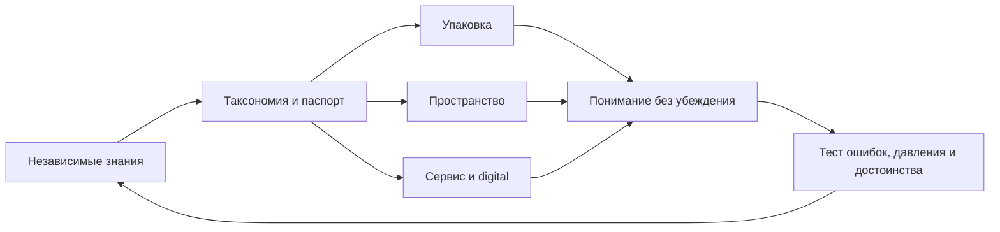

# RESPONSIBLE CONTROL — BRAND ATLAS

## Назначение

Каноническая карта `v0.2` общественного протокола информации и регулируемого доступа к психоактивным продуктам. Проект связывает классификацию, нейминг, упаковку, пространство, персонал, сенсорную среду, digital, тестирование и управление изменениями.

Это не бренд вещества, магазин или кампания. Главный инвариант: **не стимулировать употребление, не скрывать значимую информацию и не стигматизировать человека**.

## Статус

- **Версия:** `v0.2-atlas`, 2026-10-07.
- **Тип:** целостная гипотеза, готовая к прототипированию; не юридический, клинический или строительный стандарт.
- **Открыто:** юрисдикция, продукты, пороги, клинические тексты, публичное имя и знак.
- **Маркеры:** `SOURCE`, `SYNTHESIS`, `HYPOTHESIS`, `OPEN`.

## Карта

| Раздел | Вопрос | Статус |
|---|---|---|
| [[00_Brief/BRIEF_OVERVIEW\|Brief]] | Что проектируем и зачем? | Зафиксирован |
| [[01_Audit/AUDIT_OVERVIEW\|Audit]] | Что уже существует? | Desk audit завершён |
| [[02_Research/RESEARCH_OVERVIEW\|Research]] | Что известно? | Достаточно для MVP |
| [[03_Core/CORE_OVERVIEW\|Core]] | Ради чего система? | Гипотеза принята |
| [[04_Positioning/POSITIONING_OVERVIEW\|Positioning]] | Что это и чем отличается? | Гипотеза принята |
| [[05_Service_System/SERVICE_SYSTEM_OVERVIEW\|Service System]] | Как работает опыт? | Спроектирован |
| [[06_External/EXTERNAL_OVERVIEW\|External]] | Как говорит, выглядит и действует? | Стандарты v0.2 |
| [[Platform/BRAND_PLATFORM\|Platform]] | Как читать систему одним контуром? | Собирается ссылками |
| [[Outputs/OUTPUTS_OVERVIEW\|Outputs]] | Что создано? | Реестр заполнен |

## Причинная логика

## Правила

У решения есть функция, основание, статус и владелец. Производитель даёт технические данные, но не владеет consumer-языком. Риск управляет режимом. Узнаваемость создаёт порядок данных. Информация и помощь доступны без покупки. Продукт и оператор трассируются сильнее человека. Изменение запускается ошибкой или барьером, а не трендом.

## Маршрут

[[Platform/BRAND_PLATFORM|Platform]] → [[03_Core/04_Super_Idea|Super Idea]] → [[04_Positioning/POSITIONING_OVERVIEW|Positioning]] → [[05_Service_System/03_Service_Journey|Journey]] → [[06_External/03_Visual_Identity|Visual Identity]].

Для реализации: `Documentation/08_Visual_System.md` → `10_Packaging_System.md` → `11_Retail_Environment.md` → `12_Staff_Behaviour.md` → `13_Sensory_Standard.md` → `15_MVP_Prototype.md`.
