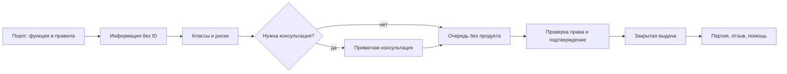

[← Карта Atlas]({{ site.baseurl }}/) · [Исходник](https://github.com/farber-vs/responsible-control-brand-atlas/blob/main/brandatlas/05_Service_System/03_Service_Journey.md)

# SERVICE JOURNEY — целевой путь

## Сквозной сценарий

| Этап | Задача | Запрет |
|---|---|---|
| Порог | Понять функцию, условия и языки | Тайный клуб или рекламный фасад |
| Информация | Читать без покупки | ID по умолчанию |
| Ориентация | Класс, форма, риск | Browsing по состоянию |
| Консультация | Уточнить факт приватно | VIP или sales |
| Очередь | Ждать без стимулов | Кассовый импульс |
| Проверка | Проверить только нужное право | Избыточная идентификация |
| Выдача | Подтвердить тип, единицу и количество | Ритуал и допродажа |
| Выход | Партия, отзыв, помощь | Купон и возвратность |

## Итог

> Человек может понять, спросить, получить или отказаться — без соблазняющего маршрута, публичного стыда и лишнего пребывания.

