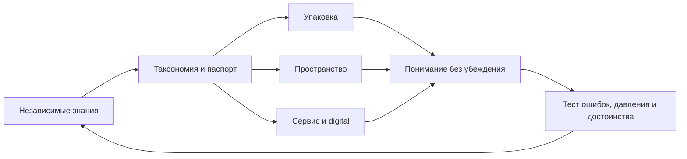

[← Карта Atlas]({{ site.baseurl }}/) · [Исходник](https://github.com/farber-vs/responsible-control-brand-atlas/blob/main/brandatlas/ATLAS_OVERVIEW.md)

# RESPONSIBLE CONTROL — BRAND ATLAS

## Назначение

Каноническая карта `v0.2` общественного протокола информации и регулируемого доступа к психоактивным продуктам. Проект связывает классификацию, нейминг, упаковку, пространство, персонал, сенсорную среду, digital, тестирование и управление изменениями.

Это не бренд вещества, магазин или кампания. Главный инвариант: **не стимулировать употребление, не скрывать значимую информацию и не стигматизировать человека**.

## Статус

- **Версия:** `v0.2-atlas`, 2026-10-07.
- **Тип:** целостная гипотеза, готовая к прототипированию; не юридический, клинический или строительный стандарт.
- **Открыто:** юрисдикция, продукты, пороги, клинические тексты, публичное имя и знак.
- **Маркеры:** `SOURCE`, `SYNTHESIS`, `HYPOTHESIS`, `OPEN`.

## Карта

| Раздел | Вопрос | Статус |
|---|---|---|
| [Brief]({{ site.baseurl }}/atlas/00_Brief/BRIEF_OVERVIEW\.html) | Что проектируем и зачем? | Зафиксирован |
| [Audit]({{ site.baseurl }}/atlas/01_Audit/AUDIT_OVERVIEW\.html) | Что уже существует? | Desk audit завершён |
| [Research]({{ site.baseurl }}/atlas/02_Research/RESEARCH_OVERVIEW\.html) | Что известно? | Достаточно для MVP |
| [Core]({{ site.baseurl }}/atlas/03_Core/CORE_OVERVIEW\.html) | Ради чего система? | Гипотеза принята |
| [Positioning]({{ site.baseurl }}/atlas/04_Positioning/POSITIONING_OVERVIEW\.html) | Что это и чем отличается? | Гипотеза принята |
| [Service System]({{ site.baseurl }}/atlas/05_Service_System/SERVICE_SYSTEM_OVERVIEW\.html) | Как работает опыт? | Спроектирован |
| [External]({{ site.baseurl }}/atlas/06_External/EXTERNAL_OVERVIEW\.html) | Как говорит, выглядит и действует? | Стандарты v0.2 |
| [Platform]({{ site.baseurl }}/atlas/Platform/BRAND_PLATFORM\.html) | Как читать систему одним контуром? | Собирается ссылками |
| [Outputs]({{ site.baseurl }}/atlas/Outputs/OUTPUTS_OVERVIEW\.html) | Что создано? | Реестр заполнен |

## Причинная логика

## Правила

У решения есть функция, основание, статус и владелец. Производитель даёт технические данные, но не владеет consumer-языком. Риск управляет режимом. Узнаваемость создаёт порядок данных. Информация и помощь доступны без покупки. Продукт и оператор трассируются сильнее человека. Изменение запускается ошибкой или барьером, а не трендом.

## Маршрут

[Platform]({{ site.baseurl }}/atlas/Platform/BRAND_PLATFORM.html) → [Super Idea]({{ site.baseurl }}/atlas/03_Core/04_Super_Idea.html) → [Positioning]({{ site.baseurl }}/atlas/04_Positioning/POSITIONING_OVERVIEW.html) → [Journey]({{ site.baseurl }}/atlas/05_Service_System/03_Service_Journey.html) → [Visual Identity]({{ site.baseurl }}/atlas/06_External/03_Visual_Identity.html).

Для реализации: `Documentation/08_Visual_System.md` → `10_Packaging_System.md` → `11_Retail_Environment.md` → `12_Staff_Behaviour.md` → `13_Sensory_Standard.md` → `15_MVP_Prototype.md`.

